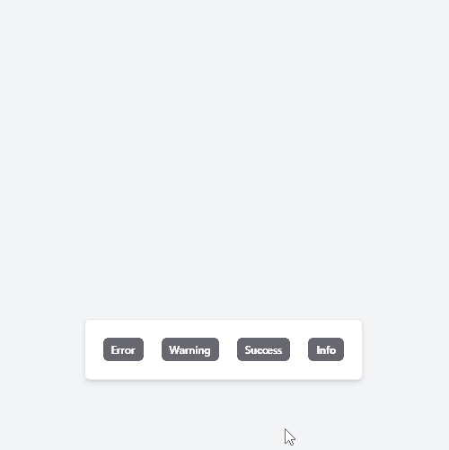

<!-- PROJECT LOGO -->
<br />
<p align="center">
  <a href="https://github.com/damikun/React-File-DragDrop">
  
  </a>

  <h3 align="center">React Toast Component</h3>

  <p align="center">
   Custom implementation of react Toast component using TailwindCSS
  </p>  
</p>

### Description

This is toast component implemented by react hooks + React Context API and stayled using tailwindCSS framework. Be free to inspirate by implementation :) This is trim of my UI lib that i use for my projects.

This componnent helps allow to push notifixtaion to user screen and auto remove it after set or default time..

Example implements this push-Events:

- Info
- Error
- Warning
- Success

#### Concepts

- Small
- Using Hooks and Context API
- Using Tailwind and Fontawesome
  (All can be adjusted by endpoint user)

### Installation

1. Clone the repo
   ```sh
   git clone https://github.com/damikun/React-File-DragDrop.git
   ```
2. Restore packages
   ```
   yarn install
   ```
3. Build and run demo
   ```
   yarn run start
   ```

<!-- USAGE EXAMPLES -->

### Configuration API

Toast Provider

- Usually placed in Providers.tsx or on top of App.tsx
- Grive you access to toast
- In this example tast are fired from "HomeComponent"

```js
<ToastProvider>
  <Layout>
    <HomePage />
  </Layout>
</ToastProvider>
```

Use any action to fire tost

- Using button to fire Toast

```js
export default function HomePage() {
  const toast = useToast();

  return (
    <div>
      <StayledButton
        variant="primaryred"
        onClick={() => toast?.pushError("Oppps Error", 5000)}
      >
        Error
      </StayledButton>
    </div>
  );
}
```

Various options to push

```js
toast?.pushError("Error messgae", 5000);
toast?.pushWarning("Warning message"); // Default timeValue
toast?.pushSuccess("Success message");
toast?.pushInfo("Info Message");
toast?.push("Message", "Info", 2000);
```

```js
type TostMessageType = "Info" | "Success" | "Warning" | "Error" | "Default";
```
