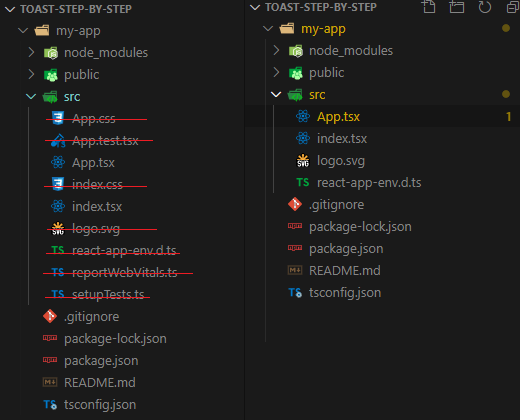

### Description

Currently many web apps use some kind of notification to let user now about the events. There are various types of notification but this article is focused only on Web App Toasts. They are not fixed to OS / Framework and do not required any aditional provider, **they are simple React functions()** and they leave only under it..

##### Instrumentation:

This step-by-step example will use

- React
- React Context API
- Styling using TailwindCSS

##### Expected result:

Toast component from scratch as **one Hook** all what you need to push events like:

- Push-Info
- Push-Error
- Push-Warning
- Push-Success
- Push-CustomBody

##### Agenda:

1. Project initialization (will use create-react-app scripts) and init TailwindCSS
2. Describe parts and implementation of ToastProvider, ToastContainer, TastMessage
3. Explain how Toast state is handled
4. Do whatever more you want by yourself :)

#### Project Init

Lets use _create-react-app_ script with typescript template. If you wanna learn more about template [click hire](https://create-react-app.dev/docs/adding-typescript/).

```
npx create-react-app my-app --template typescript
// or
yarn create react-app toast-step-by-step --template typescript
```

Now wait after all gets downloaded and initialised by package-manager.

Delete unnecesary files generated by templeate (tests and stuff around are not needed)



Fill App.tsx and index.tsx by content below:

**App.tsx**

```
import React from 'react';

export default function App() {
  return (
    <>Hello World</>
  );
}
```

**index.tsx**

```
import React from 'react';
import ReactDOM from 'react-dom';
import App from './App';

ReactDOM.render(
  <React.StrictMode>
    <App />
  </React.StrictMode>,
  document.getElementById('root')
);
```

Now try to run App using:

```
yarn run start
```

If all go well you shoud get default server info in terminal

```
Compiled successfully!

You can now view my-app in the browser.

Local:            http://localhost:3000
On Your Network:  http://172.20.10.9:3000
```

And in browser you can see _Hello World_ message.

#### Tailwind Init

Use folowing command to install tailwind and connected packages. To read more about Tailwind instalation options [click hire](https://tailwindcss.com/docs/installation).

```
yarn add tailwindcss@latest postcss@latest autoprefixer@latest
// Or
npm install tailwindcss@latest postcss@latest autoprefixer@latest
```

Create _postcss.config.js_ under root folder.

```
// In case auto init
module.exports = {
  plugins: {
    tailwindcss: {},
    autoprefixer: {},
  }
}

// Or specify plugin path
// module.exports = {
//   plugins: [
//     require("tailwindcss")("./tailwind.config.js"),
//     require("autoprefixer"),
//   ],
// };
```

Run Tailwind Init command

```
npx tailwindcss init
```

The result in console

```
tailwindcss 2.0.2
✅ Created Tailwind config file: tailwind.config.js
```

The Tailwind config was created and will be edited later... For now it can have this info: (This can look different between versions).

_tailwind.config.js_

```
module.exports = {
  purge: [],
  darkMode: false, // or 'media' or 'class'
  theme: {
    extend: {},
  },
  variants: {
    extend: {},
  },
  plugins: [],
}
```

Lets create empty CSS file _App.css_ and fill it with tailwind anotations...

- You can put any custom CSS on top of @tailwind anotations

```
// Any other custom CSS must be in this place !!!
@tailwind base;
@tailwind components;
@tailwind utilities;
```

Lets instal postcss-cli we need it to run postcss commands..

- Install it as dev dependecy

```
yarn add postcss-cli
```

Lets create new script under _package.json_ called build:css

- It will take our CSS from _App.css_ and Purge output of Tailwind classes to output file index.css

- Purge is proces of removing unused css classes to make result file smaller.

- Lets edit _start_ script to run _build:css_ bofore _react-script_

```
"scripts": {
  "start": "yarn run build:css && react-scripts start",
  "build": "react-scripts build",
  "test": "react-scripts test",
  "eject": "react-scripts eject",
  "build:css": "postcss src/App.css -o src/index.css"
},
```

Lets edit our tailwind.config.js to setup purge params.

```
module.exports = {
  purge: {
    preserveHtmlElements: true,
    enabled: true,
    content: ["./src/**/*.{ts,tsx}"],
  },
  darkMode: false, // or 'media' or 'class'
  theme: {
    extend: {},
  },
  variants: {
    extend: {},
  },
  plugins: [],
}
```

Now you can run build:css command

```
 yarn run build:css
```

- The resul is that index.css was generated
- Contains minimum CSS to run the app
- Unused CSS was removed
- Full Tailwind CSS has more that 46k of lines... Purge 450 lines..

Lets import new _index.css_ to our _index.tsx_

```
import React from 'react';
import ReactDOM from 'react-dom';
import App from './App';
import "./index.css"  // Added +

ReactDOM.render(
  <React.StrictMode>
    <App />
  </React.StrictMode>,
  document.getElementById('root')
);
```

From now you can use tailwind classes.

#### VS Code

If you are user of VSCode you can install folowing extensions to make your life better :P

- [ESLint](https://marketplace.visualstudio.com/items?itemName=dbaeumer.vscode-eslint)
- [Tailwind CSS IntelliSense](https://marketplace.visualstudio.com/items?itemName=bradlc.vscode-tailwindcss)

/// Todo...
